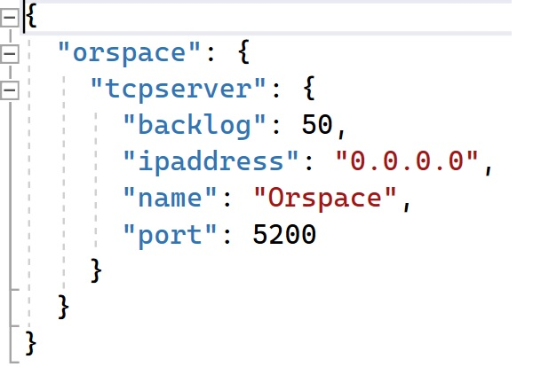

# Orspace.TcpServer
---
A simple Tcp Server to handle client connections using asynchronous apis for scalability and high performance.

Designed to work with the .NET generic host model to enable features like dependency injection, logging and app configuration loading.

## Server Configuration
The server is configured through the project `appsettings.json`. 
An example of the configuration file is shown below.

## Request Handler
Handle incoming request by implementing the `IConnectionHandler` interface. This interface contains a single method signature.
Register the concrete class with the dependency injection container (as a transient object) to hook it up with the server. A helper method `AddMessageHandler` is provided to assist with this.
Returning from this method signals an end of the connection and the server disposes of the passed in Tcpclient instance.

Make use of the passed in cancellationtoken to gracefully terminate any on going connections to avoid forceful termination by the server.
There is no need to dispose of the TcpClient instance as this is handled by the server.

If you need to do some object clean up in your Handler class, implement `IDisposable` or its asynchronous counterpart `IAsyncDisposable` 
and the server will call either `Dispose()` or `DisposeAsync()` to run your clean up code.

## Example Usage
Refer to the project `Orspace.TcpServer.Example` for an example implementation an `IConnectionHandler` class.